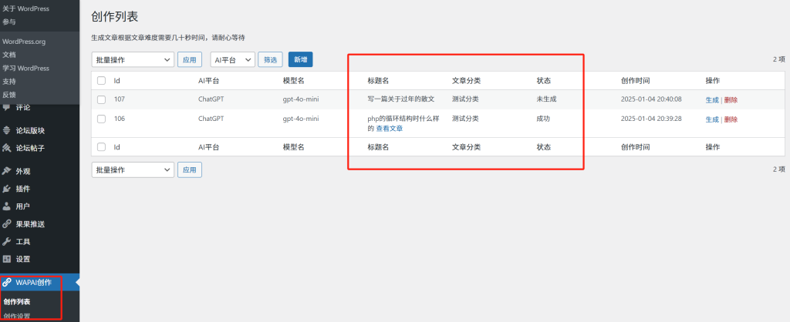
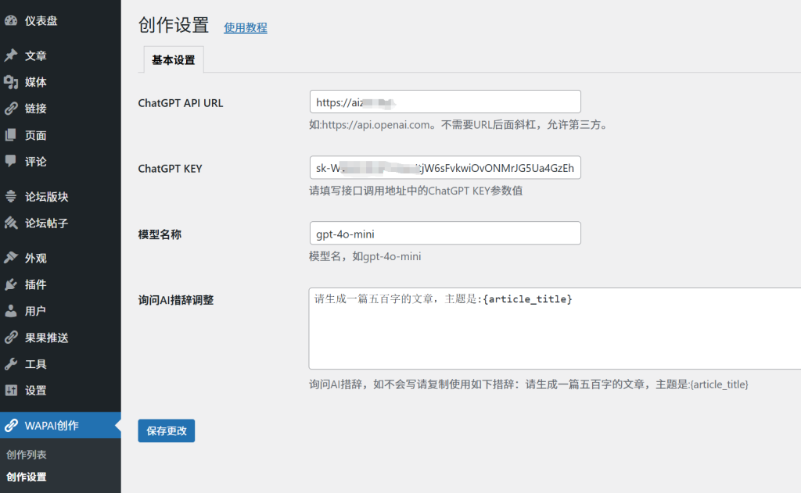
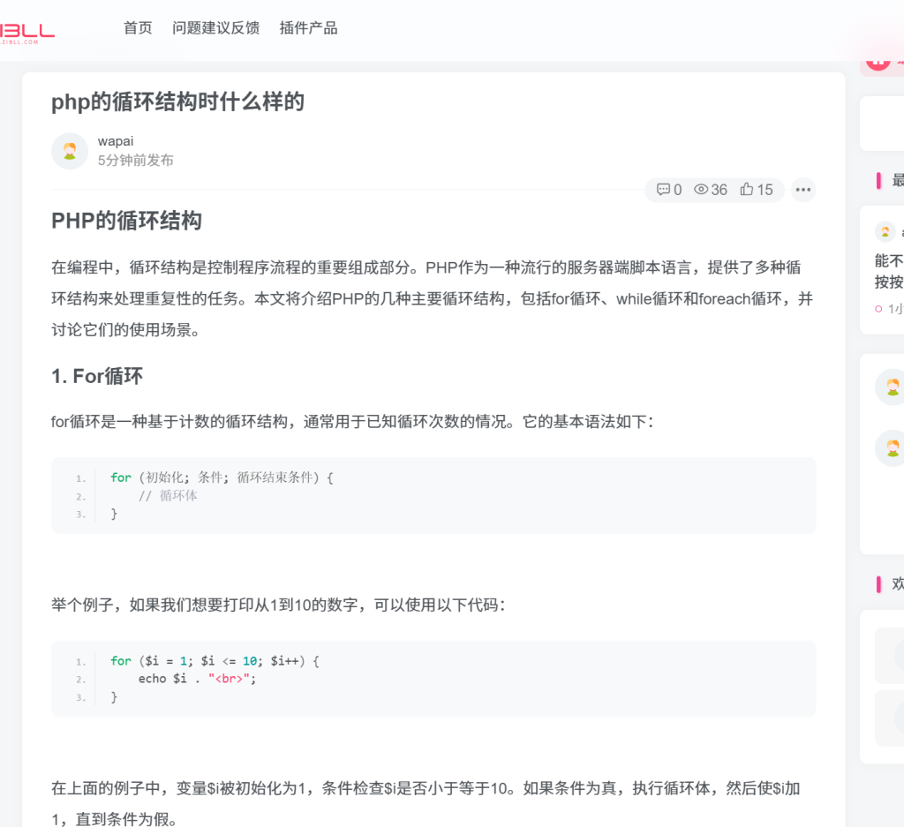

# wp-wapai-ai-create
可以快速借助ChatGPT，快速生成大量原创有深度文章，快速丰富网站内容，完全免费。

主要功能：
可以快速借助ChatGPT，快速生成大量原创有深度文章，快速丰富网站内容，完全免费。

## 1，创作列表
新建文章标题跟分类后，点击生成即可自动生成文章，生成后可以点击查看文章直达文章界面

分类可以设置不存在的，程序发现不存在会自动新建

## 2，设置界面
在此设置chatgpt相关api信息，可以使用第三方的chatgpt

## 3，生成文章界面
对AI返回的文章进行了处理，包括分类与代码的高亮显示，完美支持zibll等主题。

目前正在更新后续功能，如果您有意见，要求，欢迎留言交流。
